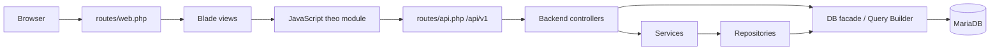

# Kiến trúc hiện tại

Tài liệu này mô tả code trên `main` tại snapshot 2026-08-11. Đây là kiến trúc **đang tồn tại**, không phải cam kết rằng mọi lớp đã nhất quán hoặc mọi module hoạt động.

## Sơ đồ request



Hai đường truy cập database đang cùng tồn tại:

- `Controller → Service → Repository → stored procedure/query`.
- `Controller → DB facade/Query Builder → stored procedure/table`.

Không nên coi sơ đồ lớp là chuẩn hoàn chỉnh: một số module bỏ qua service/repository, và một số model chưa map đúng schema.

## Điểm vào ứng dụng

### Web

`routes/web.php` đăng ký 17 route dưới `/admin`:

- Dashboard.
- Phòng ban.
- Nhân viên.
- Trang lương, chấm công, nghỉ phép.

Các route quản trị chưa có middleware auth hoặc permission.

Named-route contract chưa đồng nhất: web có `backend.backend.*`, resource API không có `api.v1` prefix và một số route nghỉ phép chưa được đặt tên.

### API

`bootstrap/app.php` đăng ký `routes/api.php`. Có 27 route dưới `/api/v1`:

| Nhóm | Số route | Vai trò |
| --- | ---: | --- |
| `cham-cong` | 4 | Danh sách nhân viên/phòng ban, chi tiết và cập nhật |
| `luong` | 11 | CRUD lương, lookup và hệ số lương |
| `nghi-phep` | 12 | CRUD nghỉ phép, nhân viên/lookup và duyệt |

Số route được lấy từ Laravel runtime. MCP code graph chỉ trích xuất được một phần route và được dùng để khám phá symbol/call graph, không phải nguồn đếm cuối.

## Các lớp code

```text
app/
├── Http/
│   ├── Controllers/Backend/
│   ├── Controllers/Frontend/
│   └── Requests/
├── Models/
├── Repositories/
└── Services/
```

### Controller

- `LuongController`, `NghiPhepController`, `ChucVuController` dùng service/repository cho CRUD chính.
- `ChamCongController` gọi Query Builder/stored procedure trực tiếp và chứa logic pagination/response.
- `LuongHeSoLuongController`, `LuongPhongBanController`, `LuongChucVuController` là endpoint phụ trợ.
- `PhongBanController` gọi procedure trực tiếp nhưng hợp đồng hiện bị lệch.
- `NhanVienController` mới có index/create/store; store chưa lưu dữ liệu.

### Request validation

Có Form Request cho lương, chấm công, nghỉ phép và chức vụ. Tuy nhiên không phải request nào cũng được controller dùng, và một số rule không khớp kiểu/độ dài/nullability trong SQL.

### Service và repository

Có bốn cặp service/repository:

- Chấm công.
- Chức vụ.
- Lương.
- Nghỉ phép.

Chúng cung cấp các action CRUD dạng `getAll/getById/create/update/delete`. Trước khi tái sử dụng, phải đối chiếu procedure thực tế và cách xử lý exception; tên lớp tồn tại không chứng minh contract đúng.

### Model

Có 14 model tương ứng phần lớn bảng nghiệp vụ, nhưng mức hoàn thiện không đồng đều. Một số model chỉ là class shell; một số quan hệ/cast đã có ở lương, nghỉ phép và chấm công.

## Blade và asset

Main hiện có ba chiến lược asset chồng nhau:

1. Layout admin `backend.layouts.app` dùng Bootstrap/Font Awesome/Bootstrap Icons/Select2 qua CDN và `public/backend/*`.
2. Trang lương, chấm công, nghỉ phép push thêm entry Vite riêng.
3. `resources/css/app.css`, `resources/js/app.js` và Primer/Tailwind là phần landing/shared cũ nhưng không nằm trong input Vite hiện tại.

Layout admin main còn thiếu `<head>` semantic hợp lệ; meta/link hiện nằm trực tiếp dưới `<html>`.

`vite.config.js` hiện build sáu entry JavaScript:

- `resources/js/frontend/luong/luong.js`
- `resources/js/frontend/luong/luongCreateUpdate.js`
- `resources/js/frontend/luong/luongHeSo.js`
- `resources/js/frontend/luong/luongHeSoCreateUpdate.js`
- `resources/js/frontend/chamcong/chamcong.js`
- `resources/js/frontend/nghiphep/nghiphep.js`

Frontend layout cũ lại yêu cầu `resources/css/app.css` và `resources/js/app.js`, nhưng hai entry này không có trong manifest hiện tại; `app.js` còn import `./bootstrap` trong khi file đó không tồn tại.

## Database

`quan_ly_nhan_su.session.sql` là nguồn schema nghiệp vụ hiện tại:

- 14 bảng.
- 1 view.
- 8 function.
- 10 trigger.
- 63 stored procedure.

Ba migrations Laravel chỉ tạo hạ tầng users/session/cache/jobs và chưa được chạy trên database live. Xem [DATABASE.md](DATABASE.md).

Laravel hiện dùng timezone `UTC`, trong khi MariaDB local dùng system timezone UTC+7 và SQL có `CURDATE()`. Những luồng dùng cả `now()` trong PHP và ngày DB có thể lệch kỳ ở ranh giới ngày/tháng cho tới khi nhóm chốt một timezone thống nhất.

## Auth và ranh giới bảo mật

Auth/RBAC chưa được tích hợp:

- Không route login/logout.
- Không middleware `auth` trên web/API.
- `config/auth.php` vẫn trỏ mặc định tới `App\Models\User`, nhưng model này không tồn tại.
- SQL dump có hướng đăng nhập qua `nhan_vien` và SHA-256; đây không phải guard/hash Laravel đã hoàn thiện.

Không đưa ứng dụng ra môi trường công khai trước khi chốt và kiểm thử ranh giới này.

## Kiến trúc mục tiêu chưa tích hợp

Branch local `frontend` chứa shell contract đã được duyệt và pass automated render/controller/build tests riêng, nhưng browser acceptance chưa hoàn tất và branch không phải ancestor của `main`. Mục tiêu được lưu tại [ADR-001](decisions/ADR-001-admin-shell.md).

Khi được phép tích hợp, cần xử lý như một thay đổi kiến trúc có chủ đích:

1. Chọn branch tích hợp từ `main`.
2. Port shell và test cần thiết, không merge mù toàn branch.
3. Giữ API/business work mới trên `main`.
4. Chuẩn hóa layout path, route name và Vite inputs.
5. Chạy lại Laravel, frontend và browser acceptance.

## Quyết định còn mở

- MariaDB 10.4 hay MySQL 8 là DBMS chuẩn của nhóm.
- Dùng `nhan_vien` hay `users` làm identity chính.
- Chuẩn data access: stored procedure qua repository hay Query Builder/Eloquent.
- Cách version schema/routine: một dump lớn hay migration/SQL scripts tách nhỏ.
- Cách tích hợp shell `frontend` vào `main`.

Khi nhóm chốt một quyết định khó đảo ngược, tạo ADR mới trong `docs/decisions/`.
