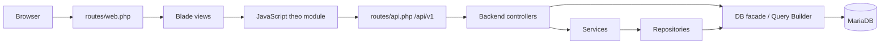

# Kiến trúc hiện tại

Tài liệu này mô tả runtime hiện hành của local `main` tại snapshot
2026-08-26. Các đoạn có nhãn **Lịch sử** chỉ giữ lại quyết định hoặc contract
cũ để truy nguyên, không phải đường chạy hiện tại.

## Sơ đồ request



Các đường truy cập database đang cùng tồn tại theo phạm vi module:

- Nhân viên và CRUD danh mục: `Controller → Service → Repository → Query Builder/table`.
- Auth/RBAC đồng nghiệp: provider/session → permission registry/Gate → route/action.
- Các module legacy khác: `Controller → Service/Repository → procedure/query`.

Không nên coi sơ đồ lớp là chuẩn hoàn chỉnh: một số module bỏ qua service/repository, và một số model chưa map đúng schema.

## Điểm vào ứng dụng

### Web

`routes/web.php` đăng ký login/logout và các route CRUD hiện hành:

- Dashboard.
- Phòng ban.
- Nhân viên.
- Trang lương, chấm công, nghỉ phép.

Các route nghiệp vụ khai báo middleware `auth` và Gate theo từng quyền. Dashboard
`/tong-quan` yêu cầu `auth`; lương, chấm công và nghỉ phép dùng riêng catalog
`Luong.*` (33–36), `ChamCong.*` (29–32) và `NghiPhep.*` (25–28). Rollout
middleware của module Nhân viên đã được loại bỏ; Hợp đồng và Phân quyền giữ
nguyên contract quyền do code đồng nghiệp cung cấp.

Resource API vẫn giữ tên resource không có tiền tố `api.v1` để tương thích; các
route phụ trợ nghỉ phép đã có tên riêng và đều đi qua auth/Gate.

### API

`bootstrap/app.php` đăng ký `routes/api.php`. Có 27 route dưới `/api/v1`:

| Nhóm | Số route | Vai trò |
| --- | ---: | --- |
| `cham-cong` | 4 | Danh sách nhân viên/phòng ban, chi tiết và cập nhật |
| `luong` | 11 | CRUD lương, lookup và hệ số lương |
| `nghi-phep` | 12 | CRUD nghỉ phép, nhân viên/lookup và duyệt |

Số route được lấy từ Laravel runtime. MCP code graph chỉ trích xuất được một phần route và được dùng để khám phá symbol/call graph, không phải nguồn đếm cuối.

## Các lớp code

```text
app/
├── Http/
│   ├── Controllers/Backend/
│   ├── Controllers/Frontend/
│   └── Requests/
├── Models/
├── Repositories/
└── Services/
```

### Controller

- `LuongController`, `NghiPhepController`, `ChucVuController` dùng service/repository cho CRUD chính.
- `ChamCongController` gọi Query Builder/stored procedure trực tiếp và chứa logic pagination/response.
- `LuongHeSoLuongController`, `LuongPhongBanController`, `LuongChucVuController` là endpoint phụ trợ.
- `PhongBanController` và `ChucVuController` dùng repository Query Builder trực tiếp.
- `NhanVienController` có list/create/store/show/edit/update/lifecycle; dữ liệu
  employee đi qua repository Query Builder trực tiếp, không còn reset mật khẩu,
  rollout flag, department scope hoặc target-role guard của nhánh cũ.

### Request validation

Có Form Request cho lương, chấm công, nghỉ phép và chức vụ. Tuy nhiên không phải request nào cũng được controller dùng, và một số rule không khớp kiểu/độ dài/nullability trong SQL.

### Service và repository

Có bốn cặp service/repository:

- Chấm công.
- Chức vụ.
- Lương.
- Nghỉ phép.

Chúng cung cấp các action CRUD dạng `getAll/getById/create/update/delete`. Trước khi tái sử dụng, phải đối chiếu procedure thực tế và cách xử lý exception; tên lớp tồn tại không chứng minh contract đúng.

### Model

Có 14 model tương ứng phần lớn bảng nghiệp vụ, nhưng mức hoàn thiện không đồng đều. Một số model chỉ là class shell; một số quan hệ/cast đã có ở lương, nghỉ phép và chấm công.

## Blade và asset

Main hiện có ba chiến lược asset chồng nhau:

1. Layout admin `backend.layouts.app` dùng Bootstrap/Font Awesome/Bootstrap Icons/Select2 qua CDN và `public/backend/*`.
2. Trang lương, chấm công, nghỉ phép push thêm entry Vite riêng.
3. `resources/css/app.css`, `resources/js/app.js` và Primer/Tailwind là phần landing/shared cũ nhưng không nằm trong input Vite hiện tại.

Layout admin main còn thiếu `<head>` semantic hợp lệ; meta/link hiện nằm trực tiếp dưới `<html>`.

`vite.config.js` hiện build sáu entry JavaScript:

- `resources/js/frontend/luong/luong.js`
- `resources/js/frontend/luong/luongCreateUpdate.js`
- `resources/js/frontend/luong/luongHeSo.js`
- `resources/js/frontend/luong/luongHeSoCreateUpdate.js`
- `resources/js/frontend/chamcong/chamcong.js`
- `resources/js/frontend/nghiphep/nghiphep.js`

Frontend layout cũ lại yêu cầu `resources/css/app.css` và `resources/js/app.js`, nhưng hai entry này không có trong manifest hiện tại; `app.js` còn import `./bootstrap` trong khi file đó không tồn tại.

## Database

Nguồn fresh active là ba file SQL chạy theo thứ tự:
`database/sql/tao_bang.sql`, `database/sql/du_lieu_mau.sql`, rồi
`database/sql/quyen_vai_tro.sql`:

- đúng 15 bảng;
- 19 nhân viên, 37 quyền và 12 thủ tục RBAC có mã số tường minh;
- `nhan_vien` chứa trực tiếp address/avatar/date columns;
- role/status/permission dùng ID contracts, symbol dotted và counter row lock;
- mã nhân viên seed/cấp mới dùng định dạng 5 chữ số; bộ đếm tự động thực tế
  cấp trong dải `00001..65535` theo giới hạn `SMALLINT UNSIGNED`.

`Database\\Seeders\\LocalDemoSeeder`, `quan_ly_nhan_su.session.sql` cùng các
script employee 001–006 là **Lịch sử**, không dùng làm fresh setup path.

Ba migrations Laravel chỉ tạo hạ tầng users/session/cache/jobs và chưa được chạy trên database live. Xem [DATABASE.md](DATABASE.md).

Baseline hiện dùng `APP_TIMEZONE=Asia/Ho_Chi_Minh` và `DB_TIMEZONE=+07:00`. Môi trường triển khai phải giữ hai giá trị đồng bộ vì SQL vẫn dùng `CURDATE()` và PHP dùng `now()`.

## Auth và ranh giới bảo mật

Auth/RBAC hiện hành vẫn được giữ theo kiến trúc đồng nghiệp:

- route `dang-nhap`/`dang-xuat`, custom `nhan-vien` provider và `App\Models\NhanVien` làm identity;
- hash mới/rehash dùng Laravel hasher; hash SHA-256 legacy chỉ được kiểm tra
  tương thích rồi CAS rehash sang bcrypt; session từ chối trạng thái 4, 5, 6;
- các route nghiệp vụ hiện hành có `auth`; Gate đối chiếu đồng thời `ma_quyen`,
  `ky_hieu_quyen` dotted và `module`;
- employee Blade action và route dùng cùng permission; CRUD hồ sơ không còn
  chặn target theo `ma_vt` hay department scope riêng;
- lookup nhân viên của Chấm công và Nghỉ phép yêu cầu web session cùng quyền
  `.Read` đúng module (`ChamCong.Read` hoặc `NghiPhep.Read`), không dùng quyền
  Nhân viên thay thế và không phụ thuộc rollout flag.

Đây là verified hẹp trên automated và disposable MariaDB; browser chưa được
kiểm chứng trong phiên hiện tại và đây chưa phải security audit production.
Các module ngoài Nhân viên vẫn cần permission/audit riêng.

## Kiến trúc mục tiêu chưa tích hợp

Branch local `frontend` chứa shell contract đã được duyệt và pass automated render/controller/build tests riêng, nhưng browser acceptance chưa hoàn tất và branch không phải ancestor của `main`. Mục tiêu được lưu tại [ADR-001](decisions/ADR-001-admin-shell.md).

Khi được phép tích hợp, cần xử lý như một thay đổi kiến trúc có chủ đích:

1. Chọn branch tích hợp từ `main`.
2. Port shell và test cần thiết, không merge mù toàn branch.
3. Giữ API/business work mới trên `main`.
4. Chuẩn hóa layout path, route name và Vite inputs.
5. Chạy lại Laravel, frontend và browser acceptance.

## Quyết định còn mở

- MariaDB 10.4 hay MySQL 8 là DBMS chuẩn của nhóm.
- Dùng `nhan_vien` hay `users` làm identity chính.
- Chuẩn data access: stored procedure qua repository hay Query Builder/Eloquent.
- Cách version schema/routine: một dump lớn hay migration/SQL scripts tách nhỏ.
- Cách tích hợp shell `frontend` vào `main`.

Khi nhóm chốt một quyết định khó đảo ngược, tạo ADR mới trong `docs/decisions/`.
